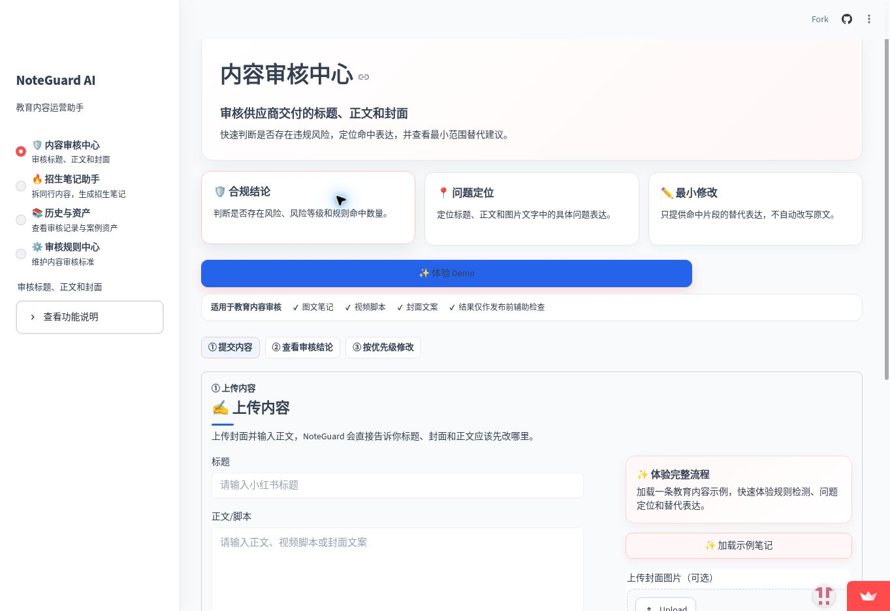

# NoteGuard AI

> **V5 评测分支：** `v5/rule-semantic-arbitration` 已完成规则-语义仲裁、冻结测试集与完整评测。评测成绩仅代表受控内部测试，不等同于线上总体准确率。

面向教育机构和内容运营人员的小红书招生内容助手：把参考内容拆解、招生笔记生成与发布前审核放进同一条工作流，帮助运营人员更快发现内容风险并形成可复用的内容资产。

**[在线体验 Demo](https://noteguard-ai-jwmmq9gayaddm6qkrey3cn.streamlit.app/)** · 免费实例休眠时，点击页面上的唤醒按钮并稍等片刻。

**我的工作：** 围绕教育内容运营的实际流程，参与需求分析、功能流程与审核规则设计、Prompt / AI 能力应用及产品迭代。开发过程中使用了 AI 辅助。



### 三步体验

1. 打开 Demo，在「内容审核中心」点击「体验 Demo」，载入脱敏示例。
2. 查看标题、正文和封面文字的规则命中、问题定位及修改建议。
3. 切到「招生笔记助手」体验参考内容拆解与笔记生成流程；在「历史与资产」「审核规则中心」了解记录沉淀和规则范围。

### 产品思路与我的工作

教育内容运营需要同时处理参考素材、招生表达和发布前风险，流程分散且容易重复劳动。规则检查负责可明确判断的风险表达、命中位置与可解释结果；大模型在配置 API Key 的环境下辅助内容分析、生成与改写。公开 Demo 的「体验 Demo」使用脱敏示例结果，**不调用真实 AI API**。项目定位为可运行的产品原型，代码实现使用了 AI 辅助；未涉及模型训练或微调。

当前核心模块：**内容审核中心、招生笔记助手、历史与资产、审核规则中心**。以下是功能与部署细节。

## V2 → V5：从人机协作到可验证的审核系统

V2 已经解决了“AI 建议不能直接覆盖原文”的问题：AI 负责识别与建议，用户可以拒绝、直接采用或编辑后采用，最终内容再进入复检。继续评测时，我发现新的核心问题不在于“关键词还不够多”，而在于 **规则层与语义层缺少仲裁**：规则命中一旦成立，语义层只能继续加风险，无法根据上下文撤销明显的误报。

因此 V5 在保留 Human-in-the-loop 与采用后复检的基础上，引入 **规则 + DeepSeek 语义审核 + 仲裁**：

- 高置信硬规则继续直接拦截；
- 否定、引用、合规提醒等上下文命中先进入语义复核；
- 语义层支持风险时保留，未支持时可清除上下文型规则误报；
- 语义服务不可用时回退为 fail-safe，不把不确定结果当作通过。

### 冻结内部测试集

V5 逻辑冻结后，使用 **80 条未参与 V5 调整的 Final Test（40 风险 / 40 安全）** 做一次完整风险二分类评测。测试集建立后不再根据其中的错误修改 V5 规则或 Prompt；如后续继续调参，需要新建下一版独立测试集。

| 指标 | rule-only | V5 完整系统 |
| --- | ---: | ---: |
| TP / TN / FP / FN | 7 / 34 / 6 / 33 | **38 / 39 / 1 / 2** |
| 准确率 | 51.25% | **96.25%** |
| 风险召回率 | 17.50% | **95.00%** |
| 精确率 | 53.85% | **97.44%** |
| 漏报率 | 82.50% | **5.00%** |
| 误报率 | 15.00% | **2.50%** |

完整评测中语义层不可用案例为 **0**。剩余 3 个误判为：

- FN：扫码加入家长群领资料 —— 漏识别私域引流；
- FN：低年级不抓阅读，后面越来越吃力 —— 漏识别隐晦焦虑营销；
- FP：培训内容引用“保证提分” —— 将合规培训语境误判为风险宣传。

> **口径说明：** 96.25% 是“80 条冻结内部测试集上的风险二分类准确率”，不是线上总体准确率，也不代表已经完成大规模生产验证。

### 小规模真实用户验证

在完成内部评测后，进一步邀请 **6 名目标用户**进行小规模试用，累计审核 **36 条真实 / 脱敏内容**。其中 **29 条建议被直接采用或修改后采用，建议采纳率 80.6%（29/36）**。

7 条未采纳建议主要落在 4 类原因：

- 建议过于保守；
- 用户认为原文已有事实依据；
- 修改后表达不够自然；
- 系统对具体上下文理解仍不够准确。

这组数据用于验证“建议是否有实际使用价值”，**不代表规模化用户留存、商业化效果或线上总体采纳率**。

### 可复现评测

V5 评测分支：`v5/rule-semantic-arbitration`

- 冻结测试集：`eval/final_v5_80.json`
- 评测脚本：`scripts/evaluate_v5.py`
- 自动化工作流：`.github/workflows/v5-final-eval.yml`

## 主要功能

- 标题、正文和封面 OCR 文字的规则审核
- 问题位置高亮与最小范围替代表达
- 小红书链接、截图和正文素材导入
- 爆款成交逻辑拆解与招生笔记生成
- 封面图片上传、粘贴与中文 OCR
- 案例库和方法模型沉淀
- 自定义审核规则管理
- 创作者资料管理
- 本地审核历史记录

## 环境要求

- Python 3.10 或更高版本，推荐 Python 3.12
- Windows、macOS 或 Linux
- 可选：DeepSeek API Key，用于 AI 改写、标题生成和分析功能
- 可选：PaddleOCR 或 Tesseract，用于自动识别图片文字

没有 API Key 或 OCR 依赖时，应用仍可使用本地规则检查和手动 OCR 文本输入。

## 环境变量配置

项目提供不包含真实凭证的 `.env.example`：

```dotenv
DEEPSEEK_API_KEY=your_api_key_here
OPENAI_API_KEY=your_openai_api_key_here
VISION_MODEL=gpt-4.1-mini
NOTEGUARD_PUBLIC_DEMO=1
```

`OPENAI_API_KEY` 与 `VISION_MODEL` 为可选配置，仅在本地 OCR 无法读取封面文字时启用图片文字理解兜底。本地使用时复制该文件为 `.env`，再填写自己实际使用的 Key。

Windows PowerShell：

```powershell
Copy-Item .env.example .env
```

macOS/Linux：

```bash
cp .env.example .env
```

编辑 `.env`：

```dotenv
DEEPSEEK_API_KEY=你的真实_API_Key
```

`.env` 已被 `.gitignore` 忽略。不要提交、截图或分享真实 API Key。

## 本地启动

### Windows PowerShell

```powershell
cd "NoteGuard-AI"
py -m venv .venv
.\.venv\Scripts\Activate.ps1
python -m pip install --upgrade pip
python -m pip install -r requirements.txt
python -m streamlit run app.py
```

### macOS/Linux

```bash
cd "NoteGuard-AI"
python3 -m venv .venv
source .venv/bin/activate
python -m pip install --upgrade pip
python -m pip install -r requirements.txt
python -m streamlit run app.py
```

启动后访问终端显示的地址，默认通常为：

```text
http://localhost:8501
```

语法和测试检查：

```bash
python -m py_compile app.py
python -m unittest discover -s tests -v
```

## Streamlit Community Cloud Secrets

部署到 Streamlit Community Cloud 时，不要上传 `.env`。在应用部署页面的 **Advanced settings → Secrets** 中配置：

```toml
DEEPSEEK_API_KEY = "你的真实_API_Key"
```

根级 Secret 会作为环境变量提供给应用。修改 Secrets 后如未立即生效，请重启应用。

公开作品集部署建议保留 `NOTEGUARD_PUBLIC_DEMO=1`：审核历史仅保存在访客当前会话，规则中心为只读，并自动使用明确标注的虚构演示档案。本地受控环境如需管理规则，可设置为 `0`。

部署时建议：

1. 入口文件选择 `app.py`。
2. Python 版本选择 3.12。
3. 确认仓库根目录包含 `requirements.txt` 和 `packages.txt`。
4. 通过 Cloud Secrets 配置 Key，不要把真实 Key 写入代码或仓库。

公开 Demo 使用说明：

- Community Cloud 的应用网址可以长期访问，但免费实例空闲后可能休眠，首次打开需要等待唤醒。
- 本地 JSON 文件不是云端持久数据库，应用重启或重新部署后，访客新增的历史、案例和业务档案可能丢失。
- 公共 Demo 不应输入真实客户资料、未公开业务数据或其他敏感信息。

## OCR 依赖

图片会依次经过压缩、放大、灰度、对比度增强和阈值处理，并进行多轮 OCR。未安装本地 OCR 或多轮识别仍无结果时，如已配置视觉模型，应用会继续读取封面主标题、小字、标签和角标；两种来源统一写入 `cover_text`，视觉结果优先。

### PaddleOCR

Python 3.10–3.13 会根据 `requirements.txt` 安装：

```text
paddlepaddle>=3.0,<4
paddleocr>=3.3,<4
```

PaddleOCR 依赖较大，首次安装、模型下载和冷启动可能耗时较长。

### Tesseract

Python 包 `pytesseract` 只是调用接口，还需要安装 Tesseract 程序和中文 `chi_sim` 语言包。

Windows：

1. 安装 Tesseract OCR。
2. 安装或勾选 `chi_sim` 中文语言数据。
3. 将 Tesseract 安装目录加入系统 `PATH`。
4. 重新打开终端后运行 `tesseract --version` 验证。

Debian/Ubuntu：

```bash
sudo apt update
sudo apt install tesseract-ocr tesseract-ocr-chi-sim
```

Streamlit Community Cloud 会读取仓库根目录的 `packages.txt` 并安装这两个系统包。

macOS：

```bash
brew install tesseract tesseract-lang
```

## 数据与安全说明

- 上传图片仅在当前 Streamlit 会话内处理，不会由应用写入图片文件。
- 历史记录、规则和创作者资料使用本地 JSON 文件，适合本地单用户或受控 Demo。
- 公开多用户部署前，应改用带用户隔离的持久存储并限制规则管理权限。
- AI 和 OCR 结果仅用于发布前辅助检查，最终内容应由用户人工确认。
